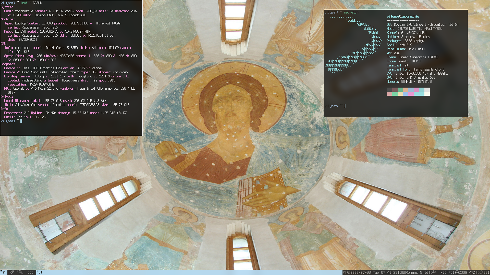
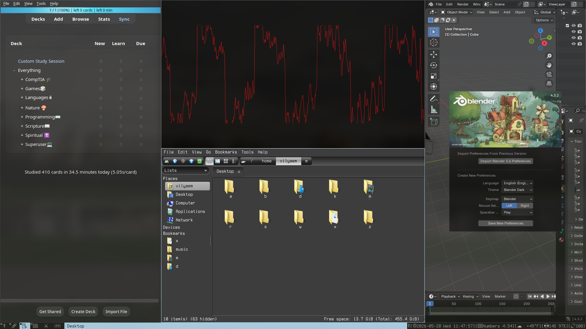

# Vilyaem's Setup





This repository contains my [Devuan](https://en.wikipedia.org/wiki/Devuan)
[OpenRC](https://en.wikipedia.org/wiki/OpenRC) setup, including, but not limited
to:

- personal scripts & programs, 
- configuration 
- forks of various programs
- wallpapers
- themes

There is a script, 'setup' that is used to help automate installs. GNU stow is
used to have a symlink-based setup.

***This script might work on just Debian, and most likely other versions of
Devuan with differing init systems, no guarantees on any of this of course.
This is meant just for my personal usecase.***


## How to Install

1. [Install Devuan](https://www.devuan.org/get-devuan) using the TUI installer
2. Ensure you can use doas/sudo with your user
3. Run this command to install my setup

```bash
bash <( curl -fsSL https://codeberg.org/knyz/vilyaemsetup/raw/branch/master/setup)
```
4. Reboot, you should be able to login 


# Featuring...
## Programs
* Vilyaem's fork of [dwm](https://dwm.suckless.org/) - window manager
    * Colours
    * Center layout
    * Center master layout
    * Fibonacci layout
    * Window swallowing
* Vilyaem's fork of [st](https://st.suckless.org/) - terminal emulator
    * Sixel image support (for file previews)
    * Scroll back
    * Transparency
    * Colourscheme
    * Flashing on bell
* Vilyaem's fork of [dmenu](https://tools.suckless.org/dmenu/) - scriptable menu
* Vilyaem's fork of [sxiv](https://wiki.archlinux.org/title/Sxiv) - simple image viewer
* Vilyaem's nhkd - the [nano hotkey daemon](https://www.uninformativ.de/git/nhkd/file/README.html), my hotkeys

## Included Configuration
* [Neovim](https://neovim.io/), the text editor
    * Spell checking
    * Autocompletion and LSP for C programming
    * File tree
    * Markdown flow
    * Easy NVchad-style buffer/tab navigation
    * Telescope
* htop
* Vim
* Yazi, the CLI file manager
* zsh, the shell
    * Auto cd (just type they directory and you will be there)
    * Autocompletion
    * Autosuggestion
    * Autocorrection
    * Helpful aliases
* [tmux](https://en.wikipedia.org/wiki/Tmux), the multiplexer
* Readline, now with Vim key-binds 
* mpv, the media player
    * Visualizer
    * Anki integration
    * Random shuffling (ctrl-r)
    * Gallery view
* OpenSCAD
* xinit
* spectrwm
* screenkey
## Included Scripts and Binaries
- bar - Status bar
- killmenu - Kill a process (sorted by CPU usage) with dmenu
- mmenu - Consume personal media like a television channel
- qalcmenu - Do quick Qalculations in dmenu
- v - pager, alias, and file-opener
- pomo - Pomodoro timer (precompiled binary)
- opusfarm - Tool for mass conversion of audio to the OPUS audio codec in parallel, but with
  preservation of metadata.


# Keyboard Layout and Keys

I primarily use *Dvorak* as my keyboard layout. I have quite a few keybindings
made with nhkd. I design them with these contraints:

- There should be some sort of mnemonic with each key
- Similar operations or alternatives can use bigger chords
- Try to avoid extensive chords on the most comon  actions

Here is a picture of a keyboard showing the hotkeys on a QWERTY and Dvorak
layout.


| Keybinding          | Action                                  | Mnemonic                              |
|---------------------|-----------------------------------------|---------------------------------------|
| F1                  | Switch to tag 1                         |                                       |
| F2                  | Switch to tag 2                         |                                       |
| F3                  | Switch to tag 3                         |                                       |
| F4                  | Switch to tag 4                         |                                       |
| F5                  | Switch to layout 1  (stack)             |                                       |
| F6                  | Switch to layout 2  (floating)          |                                       |
| F7                  | Switch to layout 3  (monocle)           |                                       |
| F8                  | Switch to layout 4  (centered master)   |                                       |
| Super+Shift+num     | Move window to tag `num`                |                                       |
| Super+Ctrl          | Close current window                    |                                       |
| Super+Enter         | Open a new terminal                     |                                       |
| Super+Grave         | Open a scratch terminal, like quake     |                                       |
| Super+Right Alt     | Toggle bar                              |                                       |
| Super+Space         | Program launcher                        |                                       |
| Super+Shift+L Ctrl  | Shut down dwm                           |                                       |
| Alt+;               | focusstack += 1                         |                                       |
| Alt+q               | focusstack -= 1                         |                                       |
| Alt+j               | incnmaster += 1                         |                                       |
| Alt+k               | incnmaster -= 1                         |                                       |
| Alt+a               | setmfact = -0.05                        |                                       |
| Alt+o               | setmfact = +0.05                        |                                       |
| Super+Tab           | alt-tabbing                             |                                       |
| Alt+Tab             | view                                    |                                       |
| Super+Shift+Space   | Toggle floating                         |                                       |
| Super+Escape        | Toggle tags                             |                                       |
| Super+q             | Password manager                        | (Q)uery bookmarks                     |
| Super+w             | GIMP                                    | (W)ork on images                      |
| Super+e             | XFCE Screenshot Tool                    | (E)xtract an image                    |
| Super+r             | LibreOffice                             | (R)eport, (R)ecord, (R)eview          |
| Super+t             | Invert the screen's colours             | (T)ransform                           |
| Super+a             | Attach or create my main tmux session   | (A)ctualize                           |
| Super+o             | Thunderbird                             | (O)utgoing mail                       |
| Super+d             | qBittorrent                             | (D)ownload                            |
| Super+f             | Book picker                             | (F)ind a book                         |
| Super+g             | Newsraft RSS reader                     | (I)nternet                            |
| Super+h             | Telegram                                | (H)ate Telegram                       |
| Super+j             | Audacious                               | (J)ukebox                             |
| Super+k             | Killmenu                                | (K)ill                                |
| Super+l             | Screenlocker                            | (L)ock                                |
| Super+z             | System monitor, htop                    | What now(?)                           |
| Super+Shift+z       | System monitor, glances                 | What now(?)                           |
| Super+;             | Qalc menu                               | (Z)ahl, (Z)eta                        |
| Super+Shift+;       | Terminal Qalc                           | (Z)ahl, (Z)eta                        |
| Super+Ctrl+Shift+;  | GUI Qalculate                           | (Z)ahl, (Z)eta                        |
| Super+x             | Yazi file manager                       | (X)plore                              |
| Super+Shift+x       | PCManFM                                 | (X)plore                              |
| Super+c             | Clipmenu                                | (C)lipboard                           |
| Super+v             | Leshy VM launcher                       | (V)irtual machine                     |
| Super+Shift+v       | Virt-Manager                            | (V)irtual machine                     |
| Super+b             | Obsidian                                | (B)rain                               |
| Super+Shift+b       | Bookworm study script                   | (B)ookworm                            |
| Super+n             | nmtui                                   | (N)etwork                             |
| Super+m             | XFCE Settings Manager                   | (M)anage settings                     |
| Super+s             | Syncthing                               | (S)ync                                |
| Super+Shift+s       | KDE Connect                             | (S)ync)                               |
| Super+Ctrl+Shift+s  | KDE Connect SMS                         | (S)ync                                |
| Super+u             | Emoji picker                            | (U)nicode                             |
| Super+y             | Media menu (`mmenu`)                    | (T)ube                                |
| Super+Shift+y       | MPV from clipboard URL                  | (Y)ank URL and play                   |
| Super+,             | KJV commandline bible                   | (W)ord of God                         |
| Super+Shift+,       | BibleTime                               | (W)ord of God                         |
| Super+.             | Wallpaper selector                      | (E)den                                |
| Super+/             | Kdenlive                                |                                       |
| Super+Shift+/       | DaVinci Resolve                         |                                       |
| Super+Ctrl+Shift+/  | Shotcut                                 |                                       |
| Super+[             | ALSA mixer                              |                                       |
| Super+Shift+[       | Pavucontrol                             |                                       |
| Super+\             | Anki                                    |                                       |
| Super+5             | Brightness down 10%                     |                                       |
| Super+6             | Brightness up 10%                       |                                       |
| Super+7             | Set brightness to 1%                    |                                       |
| Super+8             | Volume down 8%                          |                                       |
| Super+9             | Volume up 8%                            |                                       |
| Super+0             | Toggle mute                             | Toggle volume being (0)               |

## Neovim and CLI-only setup

There are two extra installation scripts available.


* "cli" - Installs only the command-line environment, helpful for:
    - Setting up a SSH environment
    - Allowing you to use your typical desktop environment, but with this
      command-line experience.

```bash
bash <( curl -fsSL https://codeberg.org/knyz/vilyaemsetup/raw/branch/master/cli)
```

* "nvim" - Installs only my Neovim (and Vim) configuration

```bash
bash <( curl -fsSL https://codeberg.org/knyz/vilyaemsetup/raw/branch/master/nvim)
```

## Read More

<https://vilyaem.xyz/wrt/File%20Organization.txt>

<https://vilyaem.xyz/wrt/MySetup.txt>

## INFO
Website: https://vilyaem.xyz

Support this project:

XMR:48Sxa8J6518gqp4WeGtQ4rLe6SctPrEnnCqm6v6ydjLwRPi9Uh9gvVuUsU2AEDw75meTHCNY8KfU6Txysom4Bn5qPKMJ75w
        
WOW:WW2L2yC6DMg7GArAH3nqXPA6UBoRogf64GodceqA32SeZQpx27xd6rqN82e36KE48a8SAMSoXDB5WawAgVEFKfkw1Q5KSGfX9
    
Liberapay: https://liberapay.com/vilyaem/donate

## "LICENSE"

My setup itself, and the contents that I myself have made herein are Public
Domain CC0, everything else is bound to its respective license.
