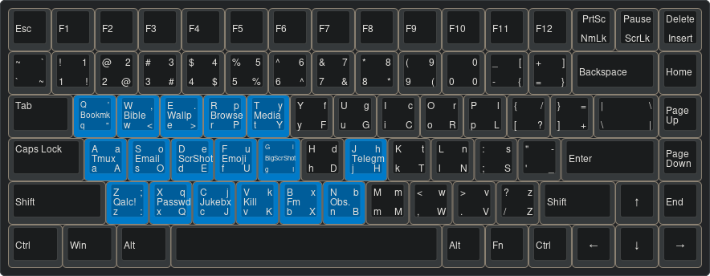

# Vilyaem's Setup

This repository contains my [Devuan](https://en.wikipedia.org/wiki/Devuan)
[OpenRC](https://en.wikipedia.org/wiki/OpenRC) setup, including personal
scripts/programs, configuration and forks of various programs I use, there is a
script, 'setup' that is used to automatically install it on a new machine. GNU
stow is used to have a symlink-based setup.

***This script might work on just Debian, and most likely other versions of
Devuan with differing init systems, no guarantees on any of this of course.
This is meant just for my personal usecase.***

My system never breaks, it's easy to pick up and maintain, and runs fast.

## How to Install

1. [Install Devuan](https://www.devuan.org/get-devuan) using the TUI installer
2. Ensure you can use doas/sudo with your user
3. Run this command to install my setup
4. Reboot, you should be able to login 

# Featuring...
## Programs
* Vilyaem's fork of [dwm](https://dwm.suckless.org/) - window manager
    * Colours
    * Center layout
    * Center master layout
    * Fibonacci layout
* Vilyaem's fork of [st](https://st.suckless.org/) - terminal emulator
    * Sixel image support (for file previews)
    * Scroll back
    * Transparency
    * Colourscheme
    * Flashing on bell
* Vilyaem's fork of [dmenu](https://tools.suckless.org/dmenu/) - scriptable menu
* Vilyaem's fork of [sxiv](https://wiki.archlinux.org/title/Sxiv) - simple image viewer
* Vilyaem's nhkd - the [nano hotkey daemon](https://www.uninformativ.de/git/nhkd/file/README.html), my hotkeys

## Included Configuration

* [Neovim](https://neovim.io/), the text editor
    * Spell checking
    * Autocompletion and LSP for C programming
    * File tree
    * Markdown flow
    * Easy NVchad style buffer/tab navigation
    * Telescope
* htop
* Vim
* Yazi, the CLI file manager
* zsh, the shell
    * Auto cd (just type they directory and you will be there)
    * Autocompletion
    * Autosuggestion
    * Autocorrection
    * Helpful aliases
* [tmux](https://en.wikipedia.org/wiki/Tmux), the multiplexer
* Tmuxinator, the tmux automation tool
* Readline, now with Vim key-binds 
* mpv, the media player
    * Visualizer
    * Anki integration
    * Random shuffling (ctrl-r)
* OpenSCAD
* xinit
* spectrwm
* screenkey
## Included Scripts and Binaries
- audmenu - Select a song for Audacious to play with dmenu
- bar - Status bar
- cl - Assembly program that clears a terminal
- killmenu - Kill a process (sorted by CPU usage) with dmenu
- mmenu - Consume personal media with dmenu
- qalcmenu - Do quick Qalculations in dmenu
- rsb - Russian Synodal Bible (precompiled binary)
- v - pager, alias, and file-opener
- vmmenu - Complete Virtual machine management system using dmenu
- yazi - Yazi file manager (precompiled binary)
- zoxide - Soy database-based directory navigation tool (precompiled binary)

# Keyboard Layout and Keys

I primarily use *Dvorak* as my keyboard layout. I have quite a few keybindings
made with nhkd. I design them with these contraints:

- Everything should be accessible with my left hand, given that it is closest to
  the Windows/super key
- There should be some sort of mnemonic with each key
- Similar operations or alternatives can use bigger chords

Here is a picture of a keyboard showing the hotkeys on a QWERTY and Dvorak
layout.

|Keybinding                                                   |Action                                                       |Mnemonic                                                     |
|-------------------------------------------------------------|-------------------------------------------------------------|-------------------------------------------------------------|
|Super+q                                                      |Open bookmark menu.                                           |(Q)uery a bookmark                                           |
|Super+w                                                      |Open commandline Bible in main Tmux session.                 |(W)ord of God                                                |
|Super+e                                                      |Wallpaper selection menu.                                     |Get an (e)xciting wallpaper.                                 |
|Super+r                                                      |Open browser.                                                 |View (p)ages.                                                |
|Super+t                                                      |Consume downloaded/personal media with mpv                   |'(T)ube.                                                     |
|Super+a                                                      |Open Tmuxinator-based Tmux session in st.                    |(A)ctualize.                                                 |
|Super+o                                                      |Open email client.                                           |(O)pen email. (S)end mail.                                   |
|Super+d                                                      |Screenshot with Maim.                                        |(D)rag a screenshot.                                         |
|Super+f                                                      |Emoji picker.                                                |Get an (e)moji.                                              |
|Super+g                                                      |Screenshot with scrot.                                       |(G)rab the screen.                                           |
|Super+j                                                      |Open Telegram client.                                        |I (h)ate Telegram.                                           |
|Super+z                                                      |Use Qalculator with dmenu script.                             |(Z)ahl. (Z)eta.                                              |
|Super+Shift+z                                                |Open Qalculator in st window.                                |(Z)ahl. (Z)eta.                                              |
|Super+Shift+Ctrl+z                                           |Open Qalculator GUI.                                         |(Z)ahl. (Z)eta.                                              |
|Super+x                                                      |Password picker using keepmenu.                              |(Q)uery a password. (X)OR.                                   |
|Super+c                                                      |Play a song in Audacious with dmenu.                         |(J)ukebox.                                                   |
|Super+v                                                      |Kill a window using killmenu.                                |(K)ill.                                                      |
|Super+b                                                      |Open file manager in separate window.                        |Disk (b)lock. (B)lock devices.                               |
|Super+n                                                      |Open GUI note related software such as QOwnNotes or Obsidian.|(N)ote.                                                      |

## "LICENSE"

My setup itself, and the contents that I myself have made herein are Public
Domain CC0, everything else is bound to its respective license.

